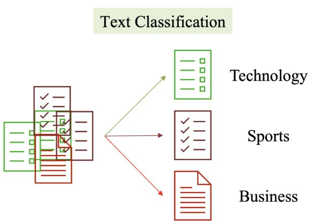

# Sentiment_Analysis
## **Overview**
This project focuses on building sentiment analysis system
The rest content of this article guide how to set up, train model and run.


### **Set up, train and evaluate**
This part will focus on:
* Install libraries
* Pre-processing data
* Load dataset
* Train model
<!-- > Note: The article has already done training model, you can move to part 2 if you want to -->


### *Prerequisites*
The following steps are for establishing environment:
1. Install python (3.10.14), you can download from this link:
[python.org](http://~https://www.python.org/downloads/)
2. Install libraries
```
    sklearn
    matplotlib
    seaborn
    numpy
    contractions
    bs4
    nltk
    pandas
```
3. Download dataset
[IMDB-Dataset](https://drive.google.com/uc?id=1v36q7Efz0mprjAv4g6TkQM2YlDKdqOuy)

4. Call out libraries
```
    from sklearn.metrics import accuracy_score
    from sklearn.ensemble import RandomForestClassifier
    from sklearn.tree import DecisionTreeClassifier
    from sklearn.preprocessing import LabelEncoder
    from sklearn.feature_extraction.text import TfidfVectorizer
    from sklearn.model_selection import train_test_split
    import matplotlib.pyplot as plt
    import seaborn as sns
    import numpy as np
    import contractions
    from bs4 import BeautifulSoup
    from nltk.stem import WordNetLemmatizer
    from nltk.corpus import stopwords
    import pandas as pd

    import re
    import string
    import nltk
```
5. Preprocess data

Remove duplicated rows
```
    df = df.drop_duplicates()
```

Remove special characters, emojis, html tag, ...
```
def preprocess_text(text):
    wl = WordNetLemmatizer()

    soup = BeautifulSoup(text, 'html.parser')  # remove html tag

    text = soup.get_text()
    text = expand_contractions(text)

    emoji_clean = re.compile("["
                             u"\U0001F600-\U0001F64F"  # emoticons
                             u"\U0001F300-\U0001F5FF"  # symbols & pictographs
                             u"\U0001F680-\U0001F6FF"  # transport & map symbols
                             u"\U0001F1E0-\U0001F1FF"  # flags (iOS)
                             u"\U00002702-\U000027B0"
                             u"\U000024C2-\U0001F251"
                             "]+", flags=re.UNICODE)

    text = emoji_clean.sub(r'', text)
    text = re.sub(r'\.(?=\S)', '. ', text)  # add space after full stop
    text = re.sub(r'http\S+', '', text)  # remove urls
    text = "".join([
        word.lower() for word in text if word not in string.punctuation
    ])  # remove punctuation and make text lower case
    text = " ".join([
        wl.lemmatize(word) for word in text.split() if word not in stop and word.isalpha()
    ])
    return text
```

6. Load and split dataset

```
x_train, x_test, y_train, y_test = train_test_split(
    df['review'], y_data, test_size=0.2, random_state=42
)
```

7. Load model

Decision Tree
```
dt_classifier = DecisionTreeClassifier(
    criterion='entropy',
    random_state=42,
    ccp_alpha=0.0,
)
```

Random Forest
```
rf_classifier = RandomForestClassifier(
    n_estimators=100,
    criterion='gini',
    max_depth=10,
    min_samples_split=2,
    min_samples_leaf=1,
    max_features='log2',
    ccp_alpha=0.0,
    random_state=42,
)
```

8. Train model
```
dt_classifier.fit(x_train_encoded, y_train)
rf_classifier.fit(x_train_encoded, y_train)
```

9. Evaluate
```
print("accuracy for use Decision Tree: ", accuracy_score(y_pred, y_test))
print("accuracy for use Random forest: ", accuracy_score(y_pred, y_test))
```